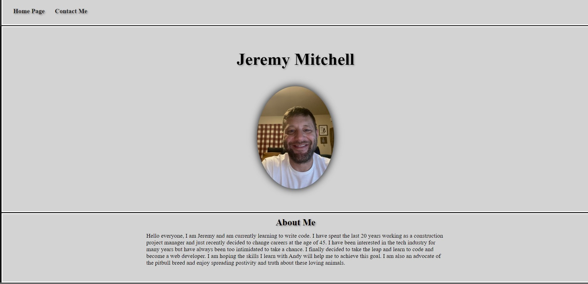

MY Simple Personal Website
=======
My Simple Personal Website 

This is a basic website built using only HTML and CSS

Summary

I have recently decided to change careers after 20 years as a Constrcution Project Manager. I have always been fascinated with the tech industry but was always too intimidated to educate myself. With a little prodding from a few friends I decided to make a switch at the age of 45 and started teaching myself to write code. I quit my job and began this journey only three weeks ago.

This is my first attempt ever at writing code. I took this opportunity to practice different design principles that I have learned, including different layout types and playing with the fonts and backgrounds. I throughly enjoyed building this website and look forward to the challenges ahead as I further my coding education and experience.

You can access my github at the following link:  https:/https://github.com/JBlacc/My-Webpage/deployments/activity_log?environment=github-pages

Author

Jeremy Mitchell -- Future Full Stack Web Developer
